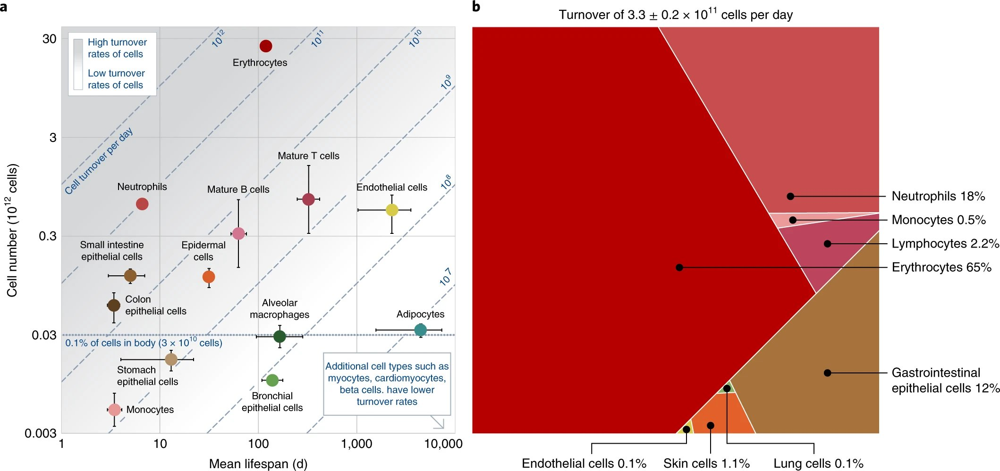

# (PART) Žmogaus biologija {-}

# Kraujotaka

Pažiūrėk į savo pirštus. Juose nėra raumenų, tačiau jie rausvi. Mūsų odai atspalvį suteikia kraujas, kuris nuolat juda iš mūsų širdies ir atgal. Nesvarbu, ar mes gulime, ar judame, kraujotaka prisitaiko ir be trikdžių užtikrina, jog visi organai išliktų aprūpinti krauju. Juo labiau, jeigu patiriame traumą, kraujotaka sugeba pati susiremontuoti ir sugyti. Mes esame varomi dinamiško, prisitaikančio vamzdyno, kuris sugeba pats save suremontuoti. Tokiu būdu mūsų kūnas gali palaikyti vidinę homeostazę ir užtikrinti signalų perdavimą. Kraujotakos sistemos supratimas yra mūsų pirmas uždavinys

Bet su visomis nuostabiomis savybėmis atsiranda iššūkiai. Širdis yra taip pat raumuo, bet jis negali būti aprūpinamas krauju *susitraukimo* metu. Krešėjimas yra subtilus balansavimas lynu tarp nepakankamo krešėjimo (ir nukraujavimo) ir per didelio krešėjimo (ir kraujagyslės užsikimšimo). Širdies susitraukimas yra savaimis, bet kaip gydyti jo sutrikimą? Tai yra antrasis mūsų uždavinys.

## Kraujas

Skystis atvirose kraujotakos sistemose yra toks pats kaip audinių skystis, nes jie tarpusavyje susisiekia. Uždaros sistemos turi pranašumą, jog skystis, kuris įprastai netiktų audinių skysčių, gali būti pritaikytas kitoms funkijoms. Voila - stuburiniuose išsivysto kraujas! Kraujas yra nuostabi medŽiaga, kuri ne tik užtikrina *dujų apykaitą*, bet taip pat *apsaugą nuo infekcijų*. Dar geriau, jis pats save apsaugo nuo ištekėjimo iš kraujagyslių  *sukrešėdamas*.

Jeigu paimtumėte mėgintuvėlį su krauju, po kurio laiko pastebėtumėte dvi dalis:

1. Plazmą (55%), kurią sudaro:
  1. Vanduo, nes kažkur turi ištirpti visa kita
  2. Elektrolitai (natris, kalis, kalcis, magnis, chlorido ir bikarbonato jonai)
  3. Baltymai (albuminas, fibrinogenas, antikūnai)
  4. Ir kitos medžiagos (hormonai, maisto medžiagos, ištirpusios dujos)!
2. Kraujo kūneliai (45%):
  1. Leukocitai (baltieji kraujo kūneliai), kurie yra dalis organizmo imuninės sistemos.
  2. Trombocitai - kraujo krešėjimas
  3. Eritrocitai (raudonieji kraujo kūnėliai), kurie perneša deguonį ir dalį CO2

Tikslumo dėlei, plazmoje ištirpę natris, kalis, kalcis, magnis ir chlorido jonai yra svarbūs palaikyti tinkamas audinių skysčių jonų koncentracijas ir *osmotinį balansą*, konkrečiai raumeniniame ir nerviniame audinyje. Pavyzdžiui, jeigu natrio koncentracija kraujyje pradeda mažėti, ji pradeda mažėti ir audinių skystyje, nes vanduo pradeda difunduoti į audinių skystį, jog druskų koncentracija ir kraujyje, ir audinių skystyje išliktų tokia pati. Dėl mažų nuokrypių gali atsirasti raumenų silpnumas (veiksmo potencialų pikai yra mažesni), dėl didesnių nuokrypių audiniai gali pradėti brinkti.

Jonai tokie kaip karbonato arba fosfato yra svarbūs *pH koncentracijai* palaikyti. Jų skirtumas nuo likusių jonų yra tas, jog jie gali prisijungti vandenilio joną ir sudaryti tarpinius joninius produktus. Karbonato jonai taip pat nuostabūs, jog jie gali skilti į vandenį ir dujas, tokiu būdu pašalindami vandenilio jonų perteklių iš organizmo.

Baltymai turi kelias funkcijas: baltymai prisideda prie *onkotinio slėgio*, dėl kurio vanduo kraujyje išlieka kraujagyslėse ir nedifunduoja į audinių skystį. Su baltymais organizme yra transportuojami steroidiniai hormonai ir kiti lipidai. Taip pat kraujyje yra specializuoti baltymai: *antikūnai* yra dalis imuninės sistemos, o *fibrinogenas* yra dalis krešėjimo sistemos.
